```mermaid
stateDiagram-v2
    [*] --> Idle
    Idle --> Planning : Start New Project
    Planning --> Designing : Approve Requirements
    Designing --> Developing : Finalize UI/UX
    Developing --> Testing : Complete Features ✔️
    Testing --> Deployment : Pass QA
    Deployment --> [*] : Launch Successfully 🎉
    Testing --> Developing : Found Bugs 🐞
    note right of Testing
      Testing includes:
      - Functional Testing
      - UI/UX Testing
      - Performance Testing
    end note
```

# Hands-on Markdown

🙂 Welcome to **Hands-on Markdown!**  
This repository is a practical guide and playground for mastering **Markdown syntax** — the lightweight and powerful markup language that's essential for writing clean documentation, README files, wikis, blogs, and more.

## Table of Contents

1. [Headings](#headings)
2. [Bold](#bold)
3. [Italic](#italic)
4. [Bold & Italic](#bold--italic)
5. [Line Breaks](#line-breaks)
6. [Strikethrough](#strikethrough)
7. [SuperScript & Subscript](#superscript--subscript)
8. [Underline](#underline)
9. [Highlight](#highlight)
10. [Comments](#comments)
11. [Blockquote](#blockquote)
12. [Ordered List](#ordered-list)
13. [Unordered List](#unordered-list)
14. [Code](#code)
15. [Horizontal Rule](#horizontal-rule)
16. [Link](#link)
17. [Image](#image)
18. [Table](#table)
19. [Code Block](#code-block)
20. [Heading ID](#heading-id)
21. [Task List](#task-list)
22. [Symbols](#symbols)
23. [Emoji](#emoji)
24. [Alerts](#alerts)
25. [Mathematical Expressions](#mathematical-expressions)
26. [Diagrams](#diagrams)
27. [Dropdown](#dropdown)
28. [Image Based on Theme](#image-based-on-theme-lightdark)
29. [Embed YouTube Video](#embed-youtube-video)
30. [Escaping Characters](#escaping-characters)
31. [HTML in Markdown](#html-in-markdown)
32. [Footnotes](#footnotes)

###  Boost Your Markdown Workflow in VS Code

Supercharge your productivity when writing and previewing Markdown in **Visual Studio Code** with these powerful extensions:gi

- [**Markdownlint**](https://marketplace.visualstudio.com/items?itemName=DavidAnson.vscode-markdownlint)  
  Ensures clean, consistent, and error-free Markdown with real-time linting.

- [**Markdown All in One**](https://marketplace.visualstudio.com/items/?itemName=yzhang.markdown-all-in-one)  
  Adds essential Markdown utilities like auto preview, shortcuts, table of contents generation, and more.

- [**Markdown Preview Github Styling**](https://marketplace.visualstudio.com/items/?itemName=bierner.markdown-preview-github-styles)  
  Renders Markdown preview in VS Code to match GitHub's styling, making documentation look exactly as it would on GitHub.

- [**Mermaid Chart**](https://marketplace.visualstudio.com/items?itemName=bierner.markdown-mermaid)  
  Instantly render [Mermaid](https://mermaid.js.org/intro/) diagrams for flowcharts, graphs, and more — right in the preview.

Press `Ctrl + Shift + V` to open the preview pane and see your Markdown rendered in VSCode.

---

## Headings

**Example:**

```markdown
# H1 - Heading **1**

## H2 - Heading 2

### H3 - Heading 3

#### H4 - Heading 4

##### H5 - Heading 5

###### H6 - Heading 6
```

**Output:**

# H1 - Heading 1

## H2 - Heading 2

### H3 - Heading 3

#### H4 - Heading 4

##### H5 - Heading 5

###### H6 - Heading 6

<!-- START "Jump to Top"-->
<p align="right">
  <a href="#table-of-contents">Jump to Top ▲</a>
</p>
<!-- END "Jump to Top" -->

## Bold

**Example:**

```markdown
**Bold Text**
```

**Output:**

**Bold Text**

<!-- START "Jump to Top"-->
<p align="right">
  <a href="#table-of-contents">Jump to Top ▲</a>
</p>
<!-- END "Jump to Top" -->

## Italic

**Example:**

```markdown
_Italic Text_
```

**Output:**

_Italic Text_

<!-- START "Jump to Top"-->
<p align="right">
  <a href="#table-of-contents">Jump to Top ▲</a>
</p>
<!-- END "Jump to Top" -->

## Bold & Italic

**Example:**

```markdown
_**Bold and Italic Text**_
```

**Output:**

_**Bold and Italic Text**_

<!-- START "Jump to Top"-->
<p align="right">
  <a href="#table-of-contents">Jump to Top ▲</a>
</p>
<!-- END "Jump to Top" -->

## Line Breaks

In Markdown, to create a line break, add two or more spaces at the end of a line and then press `Enter`. Alternatively, you can insert an explicit `<br>` tag where you want the line to break.

<!-- START "Jump to Top"-->
<p align="right">
  <a href="#table-of-contents">Jump to Top ▲</a>
</p>
<!-- END "Jump to Top" -->

## Strikethrough

It adds a horizontal line through the text.

**Example:**

```markdown
~~This text will be strikethrough~~
```

**Output:**

~~This text will be strikethrough~~

<!-- START "Jump to Top"-->
<p align="right">
  <a href="#table-of-contents">Jump to Top ▲</a>
</p>
<!-- END "Jump to Top" -->

## SuperScript & Subscript

Markdown itself doesn’t officially support superscript (`<sup>`) & subscript (`sub`), but depending on the platform (like GitHub, VS Code Preview, or Markdown renderers with HTML support), you can use HTML tags for this.

**Example:**

```html
E = mc<sup>2</sup> (Einstein's formula) <br />
This is H<sub>2</sub>O (water)
```

**Output:**  
E = mc<sup>2</sup> (Einstein's formula) <br />
This is H<sub>2</sub>O (water)

<p align="right">
  <a href="#table-of-contents">Jump to Top ▲</a>
</p>

## Underline

Standard Markdown does not natively support underlining. However, you can simulate underlining by using HTML tags within your Markdown content.

**Example:**

```html
Here is some normal text, and <u>here is underlined text</u> inside the same
line.
```

**Output:**

Here is some normal text, and <u>here is underlined text</u> inside the same line.

<!-- START "Jump to Top"-->
<p align="right">
  <a href="#table-of-contents">Jump to Top ▲</a>
</p>
<!-- END "Jump to Top" -->

## Highlight

Markdown itself does not have built-in Example for highlighting text. However, you can simulate highlighting in Markdown by using HTML tags, such as `<mark>`.

**Example:**

```html
This is <mark>highlighted</mark> text.
```

**Output:**

This is <mark>highlighted</mark> text.

<!-- START "Jump to Top"-->
<p align="right">
  <a href="#table-of-contents">Jump to Top ▲</a>
</p>
<!-- END "Jump to Top" -->

## Comments

In Markdown, there’s no native comment Example, but you can safely use HTML comments, and they will not appear when the Markdown is rendered.

**Example:**

```html
Markdown makes docs
<!-- and life -->
easier.
```

**Output:**

Markdown makes docs <!-- and life --> easier.

<!-- START "Jump to Top" -->
<p align="right" >
  <a href="#table-of-contents" >Jump to Top ▲</a>
</p>
<!-- END "Jump to Top" -->

## Blockquote

**Example (Basic):**

```markdown
> Blockquote
```

**Output:**

> Blockquote

**Example (Nested Blockquotes):**

```markdown
> This is a first-level blockquote.
>
> > This is a second-level (nested) blockquote.
> >
> > > This is a third-level (deeply nested) blockquote.
>
> Back to first-level blockquote.
```

**Output:**

> This is a first-level blockquote.
>
> > This is a second-level (nested) blockquote.
> >
> > > This is a third-level (deeply nested) blockquote.
>
> Back to first-level blockquote.

**Example (Blockquotes with Other Elements):**

````markdown
> To print in JavaScript
>
> ```javascript
> console.log("Hello, Always Smile!");
> ```
````

**Output:**

> ### To print in JavaScript
>
> ```javascript
> console.log("Hello, Always Smile!");
> ```

<!-- START "Jump to Top"-->
<p align="right">
  <a href="#table-of-contents">Jump to Top ▲</a>
</p>
<!-- END "Jump to Top" -->

## Ordered List

**Example (Basic):**

```markdown
1. First item
1. Second item
1. Third item
```

**Output:**

1. First item
1. Second item
1. Third item

**Example (Nested Order List):**

```markdown
1. First item
   1. First nested item
   2. Second nested item
2. Second item
   1. First nested item
      1. Deeply nested item
3. Third item
```

**Output:**

1. First item
   1. First nested item
   2. Second nested item
2. Second item
   1. First nested item
      1. Deeply nested item
3. Third item

> [!NOTE]
> Numbers auto-fix, formatting (bold, italic, links) allowed, indent 4 spaces for sublists.

<!-- START "Jump to Top"-->
<p align="right">
  <a href="#table-of-contents">Jump to Top ▲</a>
</p>
<!-- END "Jump to Top" -->

## Unordered List

**Example (Basic):**

```markdown
- Apple
- Banana
- Cherry
```

**Output:**

- Apple
- Banana
- Cherry

**Example (Nested Unordered List):**

```markdown
1. Frontend
   - HTML
   - CSS
     - Flexbox
     - Grid
   - JavaScript
1. Backend
   - Node.js
   - Express.js
```

**Output:**

1. Frontend
   - HTML
   - CSS
     - Flexbox
     - Grid
   - JavaScript
1. Backend
   - Node.js
   - Express.js

> [!NOTE]
> Numbers auto-fix, formatting (bold, italic, links) allowed, indent 4 spaces for sublists.

<!-- START "Jump to Top"-->
<p align="right">
  <a href="#table-of-contents">Jump to Top ▲</a>
</p>
<!-- END "Jump to Top" -->

## Code

**Example:**

```markdown
To declare a variable in JavaScript, use `let` or `const`.
```

**Output:**

To declare a variable in JavaScript, use `let` or `const`.

<!-- START "Jump to Top"-->
<p align="right">
  <a href="#table-of-contents">Jump to Top ▲</a>
</p>
<!-- END "Jump to Top" -->

## Horizontal Rule

You can create a horizontal rule by using three or more dashes (`---`), asterisks (`***`), or underscores (`___`), each on its own line. Using `---` is preferred for a clean, professional appearance and aligns with GitHub-flavored Markdown standards; therefore, it is the recommended practice.

**Example:**

```markdown
---
```

**Output:**

---

<!-- START "Jump to Top"-->
<p align="right">
  <a href="#table-of-contents">Jump to Top ▲</a>
</p>
<!-- END "Jump to Top" -->

## Link

**Example (Basic):**

```markdown
[My Drive](https://www.flickr.com/photos/spnkhn/albums/)
```

**Output:**

[My Drive](https://www.flickr.com/photos/spnkhn/albums/)

**Example (Adding Title):**

```markdown
[My Drive](https://www.flickr.com/photos/spnkhn/albums/ "You're Welcome!")
```

**Output:**

[My Drive](https://www.flickr.com/photos/spnkhn/albums/ "You're Welcome!")

**Example (Link with Inline Code):**

```markdown
[`My Drive`](https://www.flickr.com/photos/spnkhn/albums/ "You're Welcome!")
```

**Output:**

[`My Drive`](https://www.flickr.com/photos/spnkhn/albums/ "You're Welcome!")

**Example (Open a Link in a New Tab):**

```html
<a href="https://www.flickr.com/photos/spnkhn/albums/" target="_blank"
  >My Drive</a
>
```

**Output:**

<a href="https://www.flickr.com/photos/spnkhn/albums/" target="_blank">My Drive</a>

> [!TIP]
> When you paste a full URL (like `https://example.com`) directly into a Markdown file without any special Example, most Markdown renderers will automatically turn it into a clickable link.

You don't need to manually wrap it inside `[text](url)` unless you want custom text.

<!-- START "Jump to Top"-->
<p align="right">
  <a href="#table-of-contents">Jump to Top ▲</a>
</p>
<!-- END "Jump to Top" -->

## Image

**Example (Basic):**

```markdown

```

**Output:**


**Example (Image with Optional Title):**

```markdown

```

**Output:**


**Example (Image with Link):**

```markdown
[](https://www.flickr.com/photos/spnkhn/albums/)
```

**Output:**

[](https://www.flickr.com/photos/spnkhn/albums/)

**Example (Image Captions):**

Markdown alone doesn’t officially support visible image captions. But there are several **smart workarounds** using **HTML** inside Markdown.

```html
<figure align="right">
  
  <figcaption>
    Late afternoon is the day's gentle reminder that even endings can be
    beautiful
  </figcaption>
</figure>
```

**Output:**

<figure align="right">
    
    <figcaption>Late afternoon is the day's gentle reminder that even endings can be beautiful</figcaption>
</figure>

<!-- START "Jump to Top"-->
<p align="right">
  <a href="#table-of-contents">Jump to Top ▲</a>
</p>
<!-- END "Jump to Top" -->

## Table

**Example (Basic):**

```markdown
| Header 1 | Header 2 | Header 3 |
| -------- | -------- | -------- |
| Data 1   | Data 2   | Data 3   |
| Data 4   | Data 5   | Data 6   |
```

**Use to:**

- `|` (pipe) - Separates columns
- `-` (dash) - Separates header from body

**Output:**

| Header 1 | Header 2 | Header 3 |
| -------- | -------- | -------- |
| Data 1   | Data 2   | Data 3   |
| Data 4   | Data 5   | Data 6   |

**Example (Column Alignment):**

```markdown
| Left Align | Center Align | Right Align |
| :--------- | :----------: | ----------: |
| Apple      |    Orange    |      Banana |
| Cherry     |    Mango     |      Carrot |
```

**Use to:**

- `:---` - Left align
- `:---:` - Center align
- `---:` - Right align

**Output:**

| Left Align | Center Align | Right Align |
| :--------- | :----------: | ----------: |
| Apple      |    Orange    |      Banana |
| Cherry     |    Mango     |      Carrot |

<!-- START "Jump to Top"-->
<p align="right">
  <a href="#table-of-contents">Jump to Top ▲</a>
</p>
<!-- END "Jump to Top" -->

## Code Block

Markdown offers two main ways to create code blocks:

- Inline Code Block
- Multiline Code Block (Fenced Code Block)

### Inline Code Block

Use single backticks ( ` ) to show small bits of code in a line.

**Example:**

```markdown
Use the `console.log()` function to print output in JavaScript.
```

**Output:**

Use the `console.log()` function to print output in JavaScript.

### Multiline Code Block (Fenced Code Block)

Use three backticks ( ``\` ) before and after your code. You can also specify a language for syntax highlighting (like as javascript, rust, markdown, mermaid, plaintext, etc.).

````
``` <preferred_language>
    ---
       Your Code ...
           ---
    ---
```
````

**Code Block with Syntax Highlighting**  
Use this to display code with color highlighting for a specific language like `c`, `c++`, `javascript`, `rust`, etc.

**Example:**

````
```javascript

const emojis = ["😀", "🎉", "🚀", "🌈", "🍕", "🐶", "🌟"];

function getRandomEmoji() {
  const randomIndex = Math.floor(Math.random() * emojis.length);
  return emojis[randomIndex];
}

// Example usage:
console.log("Your random emoji is:", getRandomEmoji());

```
````

**Output:**

```javascript
const emojis = ["😀", "🎉", "🚀", "🌈", "🍕", "🐶", "🌟"];

function getRandomEmoji() {
  const randomIndex = Math.floor(Math.random() * emojis.length);
  return emojis[randomIndex];
}

// Example usage:
console.log("Your random emoji is:", getRandomEmoji());
```

**Code Block for Markdown Syntax (`markdown`)**  
You use `markdown` after triple backticks **only when you want to include formatted Markdown content inside a code block,** such as showing examples of Markdown syntax.

**Example:**

````
```markdown

# This is a Markdown heading

**This text will appear bold**

- List item 1
- List item 2

```
````

**Output:**

```markdown
# This is a Markdown heading

**This text will appear bold**

- List item 1
- List item 2
```

**Code Block for Diagrams or Plain Text (`plaintext`)**  
In Markdown, if you're **writing a diagram using only text or symbols,** it's a good practice (but not required) to **wrap it in a code block** using triple backticks and specify `plaintext` or nothing at all.

**Example:**

````
```plaintext

Index:  0   1   2   3   4
Value: 10  20  30  40  50
            ↑
        numbers[2]

```
````

**Output:**

```plaintext
Index:  0   1   2   3   4
Value: 10  20  30  40  50
            ↑
        numbers[2]
```

<!-- START "Jump to Top"-->
<p align="right">
  <a href="#table-of-contents">Jump to Top ▲</a>
</p>
<!-- END "Jump to Top" -->

## Heading ID

If you want to link to another part of the same Markdown file (like a heading), you can do it like this:

Example if your heading is:

```markdown
## Introduction

Welcome to the project!

## Features & Benefits

This section describes features.

## What's New?

All new updates listed here.

### Subsection: Updates

Detailed minor updates.
```

You can link to it like:

```markdown
[Introduction](#introduction)
[Go to Features](#features--benefits)
[See What's New](#whats-new)
[Minor Updates](#subsection-updates)
```

It automatically gets an ID by:

- Converting all letters to lowercase,
- Replacing spaces with hyphens (-),
- Removing special characters (like punctuation).

- Example
  - `## Introduction` - Auto-Generated ID is - `#introduction`
  - `## Features & Benefits` - Auto-Generated ID is - `#features--benefits`
  - `## What's New?` - Auto-Generated ID is - `#whats-new`
  - `Subsection: Updates` - Auto-Generated ID is - `#subsection-updates`

**Output:**

## Introduction

Welcome to the project!

## Features & Benefits

This section describes features.

## What's New?

All new updates listed here.

### Subsection: Updates

Detailed minor updates.

[Introduction](#introduction)  
[Go to Features](#features--benefits)  
[See What's New](#whats-new)  
[Minor Updates](#subsection-updates)

<!-- START "Jump to Top"-->
<p align="right">
  <a href="#table-of-contents">Jump to Top ▲</a>
</p>
<!-- END "Jump to Top" -->

## Task List

A task list lets you create checkboxes (☑ / ⏹) in Markdown.

**Use to:**

- [ ] for unchecked tasks (a blank space inside the brackets).

- [x] for checked tasks (lowercase "x" inside the brackets).

**Example:**

```markdown
### :memo: To-Do List

- [ ] Learn Markdown basics
- [x] Set up GitHub repository
- [ ] Create README.md
- [x] Push first commit
```

**Output:**

### :memo: To-Do List

- [ ] Learn Markdown basics
- [x] Set up GitHub repository
- [ ] Create README.md
- [x] Push first commit

<!-- START "Jump to Top"-->
<p align="right">
  <a href="#table-of-contents">Jump to Top ▲</a>
</p>
<!-- END "Jump to Top" -->

## Symbols

Markdown does not include dedicated syntax for special symbols. However, in most cases, you can simply copy and paste the desired **Symbol** directly into your Markdown document.

In Markdown, symbols usually mean:

- Special characters (©, →, ★, ✓)

- Emoji shortcodes (`:smile:`, 😄)

- HTML entities (`&copy;`, `&rarr;`)

### Method 1: Direct Unicode Characters

```markdown
© 2025 Your Company
```

**Output:**

© 2025 Your Company

### Method 2: Using HTML Entities

You can insert special symbols using HTML entities:

| Symbol               | Code       | Output   |
| :------------------- | :--------- | :------- |
| Copyright            | `&copy;`   | &copy;   |
| Registered trademark | `&reg;`    | &reg;    |
| Trademark            | `&trade;`  | &trade;  |
| Arrow Left           | `&larr;`   | &larr;   |
| Arrow Up             | `&uarr;`   | &uarr;   |
| Arrow Right          | `&rarr;`   | &rarr;   |
| Arrow Down           | `&darr;`   | &darr;   |
| Degree               | `&#176;`   | &#176;   |
| Pi                   | `&#960;`   | &#960;   |
| Heart                | `&hearts;` | &hearts; |
| Check Mark (tick)    | `&#10003;` | &#10003; |
| Cross mark (wrong)   | `&#10007;` | &#10007; |
| En Dash (medium)     | `&ndash;`  | &ndash;  |
| Em Dash (long)       | `&mdash;`  | &mdash;  |

**Example:**

```html
&copy; 2025 MyWebsite &mdash; All rights reserved.
```

**Output:**

&copy; 2025 MyWebsite &mdash; All rights reserved.

### Method 3: Using Emoji Shortcodes (Platform Specific)

On platforms like GitHub, you can use emoji shortcodes:

**Example:**

```markdown
:smile: :rocket: :heart: :star:
```

**Output:**

:smile: :rocket: :heart: :star:

> [!TIP]
> Use HTML entities (`&copy;`, `&rarr;`, etc) if you want maximum compatibility across different Markdown renderers.

<!-- START "Jump to Top"-->
<p align="right">
  <a href="#table-of-contents">Jump to Top ▲</a>
</p>
<!-- END "Jump to Top" -->

## Emoji

Emojis are small icons used to make Markdown documents more expressive and fun. They improve readability, highlight important parts, and add personality to your text!

**Example (Directly Copy-Paste Emoji):**

```markdown
I love coding! ☕
```

**Output:**

I love coding! ☕

**Example (GitHub-Style Emoji Shortcodes):**

```markdown
I love coding! :coffee:
```

**Output:**

I love coding! :coffee:

<!-- START "Jump to Top"-->
<p align="right">
  <a href="#table-of-contents">Jump to Top ▲</a>
</p>
<!-- END "Jump to Top" -->

## Alerts

Alerts in Markdown (on GitHub) are styled blockquotes used to highlight important info with icons and colors. Use them sparingly—no more than 1–2 per article—and avoid placing them back-to-back or nesting them.

To create one, start with `> [!TYPE]`, then write the message. Supported types:

### `[!NOTE]` — General Info

To provide extra information that adds context.

**Example:**

```markdown
> [!NOTE]
> Git commits are snapshots of your code at a given time.
```

**Output:**

> [!NOTE]
> Git commits are snapshots of your code at a given time.

### `[!TIP]` — Helpful Advice

To share best practices or shortcuts.

**Example:**

```markdown
> [!TIP]
> Use `git status` often to stay aware of your changes.
```

**Output:**

> [!TIP]
> Use `git status` often to stay aware of your changes.

### `[!IMPORTANT]` — Essential for Success

To point out information `critical to success.`

**Example:**

```markdown
> [!IMPORTANT]
> Always commit your changes before switching branches to avoid losing work.
```

**Output:**

> [!IMPORTANT]
> Always commit your changes before switching branches to avoid losing work.

### `[!WARNING]` — Urgent Caution

To alert users about things that might cause problems **right now.**

**Example:**

```markdown
> [!WARNING]
> Don’t use `git push --force` unless you fully understand the consequences.
```

**Output:**

> [!WARNING]
> Don’t use `git push --force` unless you fully understand the consequences.

### `[!CAUTION]` — Risk Alert

To warn about `possible negative effects` or mistakes.

**Example:**

```markdown
> [!CAUTION]
> Renaming branches in shared repositories can confuse collaborators.
```

**Output:**

> [!CAUTION]
> Renaming branches in shared repositories can confuse collaborators.

<!-- START "Jump to Top"-->
<p align="right">
  <a href="#table-of-contents">Jump to Top ▲</a>
</p>
<!-- END "Jump to Top" -->

## Mathematical Expressions

In Markdown, you can display **mathematical expressions** using a combination of **inline HTML** and **MathJax** (or other rendering libraries like KaTeX). Markdown itself doesn’t directly support rendering mathematical formulas, but platforms like **GitHub**, **GitLab**, and others that use **MathJax** can interpret these formulas.

Here's a guide to writing **mathematical expressions** in Markdown:

### **Using LaTeX Example with MathJax/KaTeX**

Markdown doesn’t natively support **LaTeX** math rendering, but on platforms that support MathJax or KaTeX, you can write math expressions using **LaTeX Example**.

#### Inline Math

Use **`$`** to wrap inline math expressions. For Example:

```latex
The formula for the area of a circle is $A = \pi r^2$.

The formula for water is $ \text{H}_2\text{O} $.
```

Output:

The formula for the area of a circle is $A = \pi r^2$.

The formula for water is $\text{H}\_2\text{O} $

#### Display Math

Use **`$$`** for display math (equations centered on their own line). For Example:

```latex
$$
E = mc^2
$$
```

Output:

$$
E = mc^2
$$

### **Supported Operators and Functions**

You can use the following **LaTeX math operators** within Markdown:

- **Superscript and Subscript**: `x^2` for superscript, `x_1` for subscript
- **Fractions**: `\frac{a}{b}`
- **Sums and integrals**: `\sum`, `\int`
- **Square root**: `\sqrt{x}`
- **Greek letters**: `\alpha`, `\beta`, `\gamma`, etc.
- **Trigonometric functions**: `\sin`, `\cos`, `\tan`
- **Mathematical symbols**: `\pi`, `\infty`, `\geq`

**Example (Complex Math Expression):**

```latex
$$
\int_{0}^{\infty} \frac{1}{x^2 + 1} dx = \frac{\pi}{2}
$$
```

**Output:**

$$
\int_{0}^{\infty} \frac{1}{x^2 + 1} dx = \frac{\pi}{2}
$$

<!-- START "Jump to Top"-->
<p align="right">
  <a href="#table-of-contents">Jump to Top ▲</a>
</p>
<!-- END "Jump to Top" -->

## Diagrams

In Markdown, creating diagrams can be done with several tools, but Markdown itself doesn’t directly support **drawing diagrams.**

However, there are some creative ways to embed diagrams using external tools or images.

### Method 1: Embed Diagrams as Images

The simplest method is to create the diagram with an external tool (e.g., draw.io, Lucidchart, or any diagram tool), save it as an image (PNG, JPG, etc.), and embed it in your Markdown file.

**Example:**

```markdown

```

**Output:**


### Method 2: Using Mermaid Diagrams (GitHub Flavored Markdown)

GitHub Flavored Markdown supports **Mermaid diagrams**, which allows you to draw **flowcharts, sequence diagrams, class diagrams,** etc., using simple text Example.

> [!NOTE]
>
> - You need to make sure the platform you're using (like GitHub, GitLab, or a Markdown editor) supports Mermaid diagrams to render them properly.
> - If you are working with Mermaid diagrams in VSCode, it is recommended to install the **Mermaid** official extension.

Mermaid code is written inside code blocks using the `mermaid` keyword, and the diagrams are rendered by supported platforms.

````markdown
```mermaid
<your mermaid diagram code here>
```
````

**Example (Flow Chart):**

- `TD` → Top Down

- `LR` → Left to Right

- `RL` → Right to Left

- `BT` → Bottom to Top

````markdown

````

**Output:**


**Example (Gantt Chart):**

````markdown

````

**Output:**


**Example (Timeline Chart):**

````markdown

````

**Output:**


**Example (Pie Chart):**

````markdown

````

**Output:**


**Example (Mind-Map Diagram):**

````markdown

````

**Output:**


**Example (Git-Graph Diagram):**

````markdown

````

**Output:**


**Example (State Diagram):**

````markdown

````

**Output:**


<!-- START "Jump to Top"-->
<p align="right">
  <a href="#table-of-contents">Jump to Top ▲</a>
</p>
<!-- END "Jump to Top" -->

## Dropdown

In pure Markdown, there is no built-in support for creating dropdowns (collapsible sections).
However, you can achieve dropdown-like (collapsible) behavior using HTML `<details>` and `<summary>` tags, which are supported on platforms like GitHub, GitLab, and others that allow HTML inside Markdown.

**Example (In HTML):**

```html
<details>
  <summary>Click to expand</summary>

  Content inside the dropdown.
</details>
```

**Example:**

```html
<details>
  <summary>See More Details</summary>

  Here is some hidden content that only appears when you click the dropdown! -
  Point 1 - Point 2 - **Bold Content** - [Link to
  somewhere](https://example.com)
</details>
```

**Output:**

<details>
  <summary>See More Details</summary>

Here is some hidden content that only appears when you click the dropdown!

- Point 1
- Point 2
- **Bold Content**
- [Link to somewhere](https://example.com)

</details>

<!-- START "Jump to Top"-->
<p align="right">
  <a href="#table-of-contents">Jump to Top ▲</a>
</p>
<!-- END "Jump to Top" -->

## Image Based on Theme (Light/Dark)

Normally, basic Markdown (``) doesn't change images automatically based on the theme (light/dark mode).
But using **HTML inside Markdown,** you can!

You can use HTML `<picture>`, `<source>`, and `` tags inside your Markdown file to switch images based on the user's system theme.

**Example (In HTML):**

```html
<picture>
  <source
    srcset="./assets/images/dark-mode.png"
    media="(prefers-color-scheme: dark)"
  />
  <source
    srcset="./assets/images/light-mode.png"
    media="(prefers-color-scheme: light)"
  />
  
</picture>
```

**Output:**

<picture>
  <source srcset="./assets/images/dark-mode.png" media="(prefers-color-scheme: dark)">
  <source srcset="./assets/images/light-mode.png" media="(prefers-color-scheme: light)">
  
</picture>

Explanation:

- If user's system is in dark mode, it will load dark-image.png.

- If user's system is in light mode, it will load light-image.png.

- Fallback img is also light-image.png.

<!-- START "Jump to Top"-->
<p align="right">
  <a href="#table-of-contents">Jump to Top ▲</a>
</p>
<!-- END "Jump to Top" -->

## Embed YouTube Video

In Markdown, you can **embed a YouTube video** using a simple method with a link or by integrating **HTML** directly into your Markdown file. Here’s how you can do both:

**Example (Embed YouTube Video with an Image Link):**

```markdown
[](https://www.youtube.com/watch?v=VIDEO_ID)
```

**Use to:**

- **Get YouTube Video_ID:** This is the string after `v=` in the YouTube URL. For example, in `https://www.youtube.com/watch?v=8SbUC-UaAxE`, the ID is `8SbUC-UaAxE`.

- Replace `VIDEO_ID` with the unique video ID from the YouTube URL.

- This will show an image (thumbnail) of the video and when clicked, the user will be redirected to the **YouTube page.**

**Example:**

```markdown
[](https://www.youtube.com/watch?v=8SbUC-UaAxE)
```

**Output:**

[](https://www.youtube.com/watch?v=8SbUC-UaAxE)

<!-- START "Jump to Top"-->
<p align="right">
  <a href="#table-of-contents">Jump to Top ▲</a>
</p>
<!-- END "Jump to Top" -->

## Escaping Characters

**Escaping** means telling **Markdown to treat a character as plain text,** not as special formatting.  
Markdown uses special characters (like `*`, `_`, `#`,`[ ]`), so escaping is needed when you want them to appear literally.

### List of Characters You Can Escape

| Character | Description                    | Example (Without Escape)    |
| :-------- | :----------------------------- | :-------------------------- |
| `\`       | Backslash itself               | `\\Hello` → \Hello          |
| `` ` ``   | Backtick (code)                | `` `code` `` → `code`       |
| `*`       | Asterisk (bold/italic)         | `*bold*` → _bold_           |
| `_`       | Underscore (italic)            | `_italic_` → _italic_       |
| `{}`      | Curly braces                   | `{text}` → {text}           |
| `[]`      | Square brackets (links/images) | `[text]` → [text]           |
| `()`      | Parentheses (links/images)     | `(link)` → (link)           |
| `#`       | Hash (heading)                 | `# Heading` → # Heading     |
| `+`       | Plus (lists)                   | `+ Item` → + Item           |
| `-`       | Minus (lists)                  | `- Item` → - Item           |
| `.`       | Dot (lists)                    | `1. Item` → 1. Item         |
| `!`       | Exclamation mark (images)      | `` →  |
| `>`       | Greater than (quotes)          | `> Quote` → > Quote         |

### How to Escape Characters

Use a backslash `\` before the special character.

| You Write (With Escape) | You See                     |
| :---------------------- | :-------------------------- |
| `\*bold\*`              | bold (without formatting)   |
| `\_italic\_`            | italic (no formatting)      |
| `\# Heading`            | # Heading (not a header)    |
| `1\. Item one`          | 1. Item one (no auto list)  |
| `\`       | (no image)                  |
| `\|Table\|`             | \|Table\| (no table format) |

<!-- START "Jump to Top"-->
<p align="right">
  <a href="#table-of-contents">Jump to Top ▲</a>
</p>
<!-- END "Jump to Top" -->

## HTML in Markdown

**Markdown fully supports raw HTML** — meaning you can directly embed HTML tags inside your `.md` files.

This is very useful when:

- Markdown Example is too limited
- You need more control (like tables, styled images, videos, divs)

**Some Common Use Cases:**

- **Complex tables** - Markdown tables are basic
- **Custom image attributes** - Add width, height, styles
- **Centering text/images** - Markdown can’t center easily
- **Videos/iframes** - Markdown doesn't support embeds
- **Div blocks** - Custom layout and styling

**Example (HTML inside Markdown):**

```html
<p align="center">his is a paragraph using HTML inside Markdown.</p>
```

**Output**

<p align="center">This is a paragraph using HTML inside Markdown.</p>

<!-- markdownlint-disable MD013 MD032 -->

> [!CAUTION]
>
> **GitHub README restrictions:**
>
> - Disallows `<iframe>`, `<script>`, `<style>` for security reasons.
> - Basic tags like `<p>`, ``, `<table>`, `<div>`, `<span>` are allowed.

<!-- START "Jump to Top"-->
<p align="right">
  <a href="#table-of-contents">Jump to Top ▲</a>
</p>
<!-- END "Jump to Top" -->

## Footnotes

To add a footnote in Markdown, you use the following format:

- Add a superscript reference number inside square brackets ([1]) where you want the footnote to appear.

- Below the text, provide the reference using the same number in square brackets, followed by a colon and the footnote content.

**Example (Basic):**

```markdown
This is a sentence with a footnote reference.[^1]

[^1]: This is the footnote content.
```

**Output:**

This is a sentence with a footnote reference.[^1]

[^1]: This is the footnote content.

**Example (Footnote with Links):**

```markdown
Learn more about Markdown at [Markdown Guide](https://www.markdownguide.org).
```

You can also include links inside footnotes. This is useful for providing references or citing sources.

**Output:**

Learn more about Markdown at [Markdown Guide](https://www.markdownguide.org)[^2].

[^2]: The source of Markdown documentation is [here](https://www.markdownguide.org/).

<!-- START "Jump to Top"-->
<p align="right">
  <a href="#table-of-contents">Jump to Top ▲</a>
</p>
<!-- END "Jump to Top" -->

## **📄 License**

This project is licensed under the MIT License - see the [LICENSE](LICENSE) file for details.

## **🤝 Contributing**

Pull requests are welcome. For major changes, please open an issue first to discuss what you would like to change.
